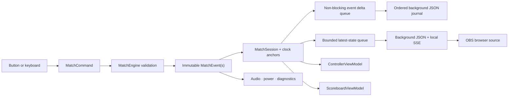

# Architecture

## Dependency direction

```text
ThreeByThree.Centar.Scoreboard.Wpf
        │
        ├── ThreeByThree.Centar.Scoreboard.Application
        └── ThreeByThree.Centar.Scoreboard.Infrastructure
                    │
                    └── ThreeByThree.Centar.Scoreboard.Application
                                  │
                                  └── ThreeByThree.Centar.Scoreboard.Domain
```

`Domain` has no project dependencies. `Application` owns orchestration and platform abstractions. `Infrastructure` implements JSON, settings, audio, logging, monitor enumeration, and Windows power integration. `Wpf` is the composition root and presentation layer.

## Command and update flow



Neither window mutates match state. Both project the same synchronized `MatchSession`.

## Clock model

A running clock stores:

- remaining duration at the instant it started;
- a monotonic timestamp from `TimeProvider`;
- its running flag.

Displayed remaining time is `anchorRemaining - monotonicElapsed`, clamped at zero. The 40 ms WPF ticker redraws projected state only; it never changes domain state or writes tick events. A one-shot timer schedules the expiration command.

## Event replay and undo

Events have unique IDs and increasing sequence numbers. `MatchReducer.Replay` sorts by sequence and excludes events targeted by `EventRevertedEvent`. Undo therefore preserves the audit trail.

Coin-toss winner and choice are part of the immutable game-created metadata.
The reducer projects the correct opening possession, and `OvertimeStartedEvent`
records the derived overtime possession. A positive overtime score that reaches
two overtime points appends `GameEndedEvent` in the same command, so the match
becomes final immediately without a win-by-two check. Regular-time score 21 is
not consulted while the state is in overtime.

Saved-game snapshots contain the complete event stream and the latest projected
clocks. Opening an unfinished document validates and replays authoritative
state, then appends recovery-source clock-set events with both clocks paused.
Opening a finished document projects its final state without enabling play.
Time does not continue while the application is closed.

## Persistence safety

Every committed command queues only its new immutable events and matching
snapshot. A single background consumer orders events by sequence, rebuilds the
complete recovery document, and writes it without performing serialization or
disk I/O on the controller thread. A later successful write contains the full
event stream, so it also heals over an earlier transient save failure.

Game files and settings use same-directory temporary files, write-through
flushes, and atomic replacement. If the process stops during a write, the
previous valid game file remains in place. Every match has one stable file:

```text
Documents\3x3 Centar Scoreboard\Games\YYYY-MM-DD_match-id.json
```

The same file is updated from the first action through finalization. The saved
game catalog validates all JSON files, ignores damaged entries, de-duplicates
legacy copies by match ID, and sorts matches newest-first. Older date-folder
archives and the legacy active-game file remain discoverable. Installer files
are under Program Files; user data is never an installer component.

## Threading

- `MatchSession` protects event state, clock anchors, and timers with one lock.
- Event notifications occur after leaving the lock.
- WPF view models marshal background timer/persistence notifications onto the dispatcher.
- Persistence and diagnostics use single-reader channels to keep serialization
  and disk I/O off the UI thread and retain per-match write order.
- The persistence event handler only copies the newly committed event batch and
  performs a non-blocking channel write.
- The local OBS publisher performs only a non-blocking `TryWrite` from match
  notifications. A capacity-one background queue coalesces obsolete display
  states, while JSON serialization, 10 Hz running-clock sampling, Kestrel, and
  each SSE client run independently of both scoreboard windows.
- Slow or disconnected overlay clients cannot create backpressure: every client
  has its own capacity-one latest-state queue, and overlay startup/delivery
  failures are logged without affecting match operation.
